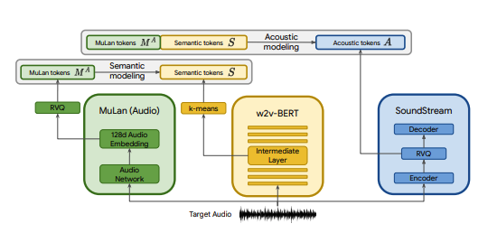
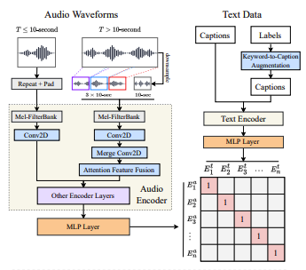

# Open MusicLM
Pytorch implementation of [MusicLM](https://arxiv.org/abs/2301.11325), a SOTA text to music model published by Google, with a few modifications. We use [CLAP](https://github.com/LAION-AI/CLAP) as a replacement for MuLan, [Encodec](https://github.com/facebookresearch/encodec) as a replacement for SoundStream, and [MERT](https://huggingface.co/m-a-p/MERT-v0) as a replacement for w2v-BERT.

<p align='center'>


</p>

## Why CLAP?
CLAP is a joint audio-text model trained on [LAION-Audio-630K](https://github.com/LAION-AI/audio-dataset). Similar to MuLan, it consists of an audio tower and a text tower that project their respective media onto a shared latent space (512 dimensions in CLAP vs 128 dimensions in MuLan).

MuLan was trained on 50 million text-music pairs. Unfortunately I don't have the data to replicate this, so I'm relying on CLAP's pretrained checkpoints to come close. CLAP was trained on 2.6 million total text-audio pairs from LAION-630k (~633k text-audio pairs) and AudioSet (2 million samples with captions generated by a keyword-to-caption model). Although this is a fraction of the data used to train MuLan, we have successfully used CLAP to generate diverse music samples, which you can listen to [here](https://drive.google.com/drive/folders/1pGY8EP2EZlE2pPpXn5E3YAkoCgATWw3_) (keep in mind these are very early results). In the event that CLAP's latent space is not expressive enough for music generation, we can train CLAP on music or substitute the model for @lucidrain's [MuLan implementation](https://github.com/lucidrains/musiclm-pytorch) once it is trained.

## Why Encodec?
SoundStream and Encodec are both neural audio codecs that encode any waveform to a sequence of acoustic tokens, which can then be decoded into a waveform resembling the original. These intermediate tokens can then be modeled as a seq2seq task. [Encodec](https://github.com/facebookresearch/encodec) is released by Facebook and pretrained checkpoints are publicly available, whereas this is not the case with SoundStream.

## Differences from @lucidrains implementation
- Autoregressively models the CLAP/MuLan conditioning signal by passing it into the transformers as discrete tokens, as mentioned in section 3.1 of the paper. Musiclm-pytorch conditions on them with cross attention.
- TokenConditionedTransformer can support variable token sequences, which makes it easy to do further experimentation (e.g. combining multiple conditioning signals, stereo waveform generation, etc.)
- Uses existing open source models instead of training MuLan and SoundStream.
- Some modifications to increase the chance of successfully training the model.

# End Goal
The goal of this project is to replicate the results of MusicLM as quickly as possible without necessarily sticking to the architecture in the paper. For those looking for a more true-to-form implementation, check out [musiclm-pytorch](https://github.com/lucidrains/musiclm-pytorch). 

We also seek to gain a better understanding of CLAP's latent space.

Join us on discord if you'd like to get involved! [](https://discord.gg/jN8jADShX5)

# Usage
## Install
```shell
conda env create -f environment.yaml
conda activate open-musiclm
```

## Configs
A "model config" contains information about the model architecture such as the number of layers, number of quantizers, target audio lengths for each stage, etc. It is used to instantiate the model during training and inference.

A "training config" contains hyperparameters for training the model. It is used to instantiate the trainer classes during training.

See the `./configs` directory for example configs.

## Training
### CLAP RVQ
The first step is to train the residual vector quantizer that maps continuous CLAP embeds to a discrete token sequence.
```shell
python ./scripts/train_clap_rvq.py \
    --results_folder ./results/clap_rvq \ # where to save results and checkpoints
    --model_config ./configs/model/musiclm_small.json \ # path to model config
    --training_config ./configs/training/train_musiclm_fma.json # path to training config
```

### Hubert K-means
Next, we learn a K-means layer that we use to quantize our MERT embeddings into semantic tokens.
```shell
python ./scripts/train_hubert_kmeans.py \
    --results_folder ./results/hubert_kmeans \ # where to save results and checkpoints
    --model_config ./configs/model/musiclm_small.json \
    --training_config ./configs/training/train_musiclm_fma.json
```

### Semantic Stage + Coarse Stage + Fine Stage
Once we have a working K-means and RVQ, we can now train the semantic, coarse and fine stages. These stages can be trained concurrently.
```shell
python ./scripts/train_semantic_stage.py \
    --results_folder ./results/semantic \ # where to save results and checkpoints
    --model_config ./configs/model/musiclm_small.json \
    --training_config ./configs/training/train_musiclm_fma.json \
    --rvq_path PATH_TO_RVQ_CHECKPOINT \ # path to previously trained rvq
    --kmeans_path PATH_TO_KMEANS_CHECKPOINT # path to previously trained kmeans
```
```shell
python ./scripts/train_coarse_stage.py \
    --results_folder ./results/coarse \ # where to save results and checkpoints
    --model_config ./configs/model/musiclm_small.json \
    --training_config ./configs/training/train_musiclm_fma.json \
    --rvq_path PATH_TO_RVQ_CHECKPOINT \ # path to previously trained rvq
    --kmeans_path PATH_TO_KMEANS_CHECKPOINT # path to previously trained kmeans
```
```shell
python ./scripts/train_fine_stage.py \
    --results_folder ./results/fine \ # where to save results and checkpoints
    --model_config ./configs/model/musiclm_small.json \
    --training_config ./configs/training/train_musiclm_fma.json \
    --rvq_path PATH_TO_RVQ_CHECKPOINT \ # path to previously trained rvq
    --kmeans_path PATH_TO_KMEANS_CHECKPOINT # path to previously trained kmeans
```

## Preprocessing
In the above case, we are using CLAP, Hubert and Encodec to generate clap, semantic and acoustic tokens live during training. However, these models take up space on the GPU, and it is inefficient to recompute these tokens if we're making multiple runs on the same data. We can instead compute these tokens ahead of time and iterate over them during training.

To do this, fill in the `data_preprocessor_cfg` field in the config and set `use_preprocessed_data` to True in the trainer configs (look at train_fma_preprocess.json for inspiration). Then run the following to preprocess the dataset, followed by your training script.

```shell
python ./scripts/preprocess_data.py \
    --model_config ./configs/model/musiclm_small.json \
    --training_config ./configs/training/train_fma_preprocess.json \
    --rvq_path PATH_TO_RVQ_CHECKPOINT \ # path to previously trained rvq
    --kmeans_path PATH_TO_KMEANS_CHECKPOINT # path to previously trained kmeans
```

## Inference
Generate multiple samples and use CLAP to select the best ones:
```shell
python scripts/infer_top_match.py \
    "your text prompt"
    --num_samples 4                                 # number of samples to generate
    --num_top_matches 1                             # number of top matches to return
    --semantic_path PATH_TO_SEMANTIC_CHECKPOINT \   # path to previously trained semantic stage
    --coarse_path PATH_TO_COARSE_CHECKPOINT \       # path to previously trained coarse stage
    --fine_path PATH_TO_FINE_CHECKPOINT \           # path to previously trained fine stage
    --rvq_path PATH_TO_RVQ_CHECKPOINT \             # path to previously trained rvq
    --kmeans_path PATH_TO_KMEANS_CHECKPOINT         # path to previously trained kmeans
    --model_config ./configs/model/musiclm_small.json \
    --duration 4
```

Generate samples for various test prompts:
```shell
python scripts/infer.py \
    --semantic_path PATH_TO_SEMANTIC_CHECKPOINT \   # path to previously trained semantic stage
    --coarse_path PATH_TO_COARSE_CHECKPOINT \       # path to previously trained coarse stage
    --fine_path PATH_TO_FINE_CHECKPOINT \           # path to previously trained fine stage
    --rvq_path PATH_TO_RVQ_CHECKPOINT \             # path to previously trained rvq
    --kmeans_path PATH_TO_KMEANS_CHECKPOINT         # path to previously trained kmeans
    --model_config ./configs/model/musiclm_small.json \
    --duration 4
```

You can use the `--return_coarse_wave` flag to skip the fine stage and reconstruct audio from coarse tokens alone.

## Checkpoints
You can download experimental checkpoints for the musiclm_large_small_context model [here](https://drive.google.com/drive/u/0/folders/1347glwEc-6XWulfU7NGrFrYTvTnjeVJE). To fine tune the model, call the train scripts with the `--fine_tune_from` flag.

# Thank you
* [Okio](https://okio.ai/) for providing compute to train the model! Okio is a startup that is developing Nendo - an open source generative music tool-suite
that re-imagines music. If you're interested check them out at [okio.ai](https://okio.ai/)
* [@lucidrains](https://github.com/lucidrains/) for the [audiolm-pytorch](https://github.com/lucidrains/audiolm-pytorch) implementation. This repo contains a refactored version of a lot of the code in [audiolm-pytorch](https://github.com/lucidrains/audiolm-pytorch).
* [LAION](https://laion.ai/) for [CLAP](https://github.com/LAION-AI/CLAP)
* [Music Audio Pretrain team](https://huggingface.co/m-a-p) for [MERT](https://huggingface.co/m-a-p/MERT-v0)

# Citations
```bibtex
@inproceedings{Agostinelli2023MusicLMGM,
    title     = {MusicLM: Generating Music From Text},
    author    = {Andrea Agostinelli and Timo I. Denk and Zal{\'a}n Borsos and Jesse Engel and Mauro Verzetti and Antoine Caillon and Qingqing Huang and Aren Jansen and Adam Roberts and Marco Tagliasacchi and Matthew Sharifi and Neil Zeghidour and C. Frank},
    year      = {2023}
}
```
```bibtex
@article{wu2022large,
  title     = {Large-scale Contrastive Language-Audio Pretraining with Feature Fusion and Keyword-to-Caption Augmentation},
  author    = {Wu, Yusong and Chen, Ke and Zhang, Tianyu and Hui, Yuchen and Berg-Kirkpatrick, Taylor and Dubnov, Shlomo},
  journal   = {arXiv preprint arXiv:2211:06687},
  year      = {2022},
}
```
```bibtex
@article{defossez2022highfi,
  title     = {High Fidelity Neural Audio Compression},
  author    = {Défossez, Alexandre and Copet, Jade and Synnaeve, Gabriel and Adi, Yossi},
  journal   = {arXiv preprint arXiv:2210.13438},
  year      = {2022}
}
```
```bibtex
@misc{li2023mert,
  title     = {MERT: Acoustic Music Understanding Model with Large-Scale Self-supervised Training}, 
  author    = {Yizhi Li and Ruibin Yuan and Ge Zhang and Yinghao Ma and Xingran Chen and Hanzhi Yin and Chenghua Lin and Anton Ragni and Emmanouil Benetos and Norbert Gyenge and Roger Dannenberg and Ruibo Liu and Wenhu Chen and Gus Xia and Yemin Shi and Wenhao Huang and Yike Guo and Jie Fu},
  year      = {2023},
  eprint    = {2306.00107},
  archivePrefix = {arXiv},
  primaryClass  = {cs.SD}
}
```
